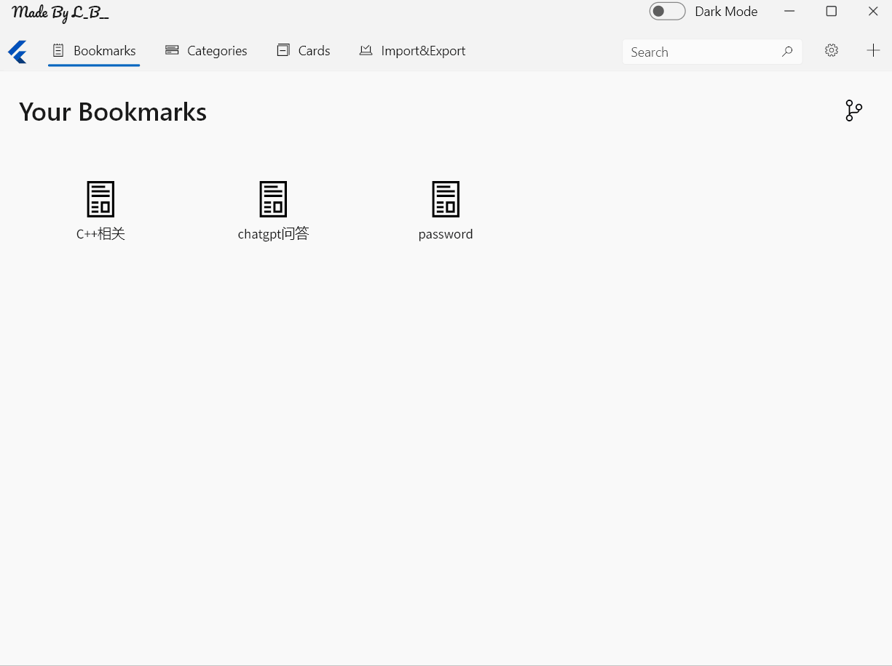
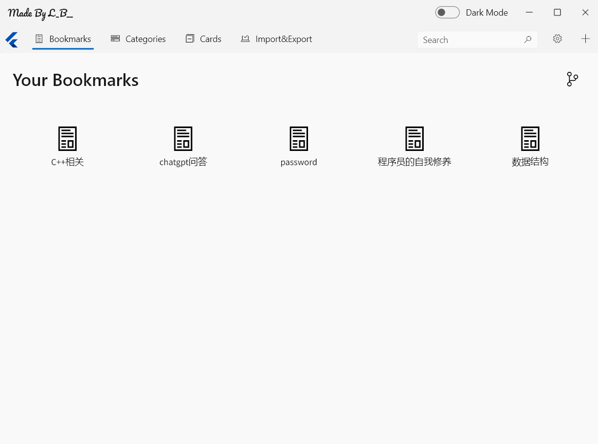
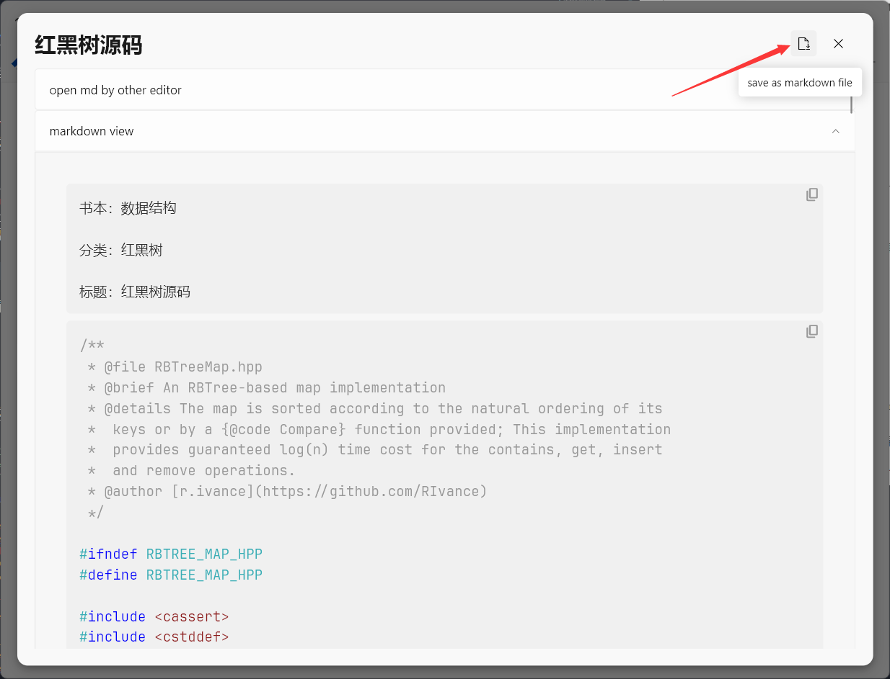
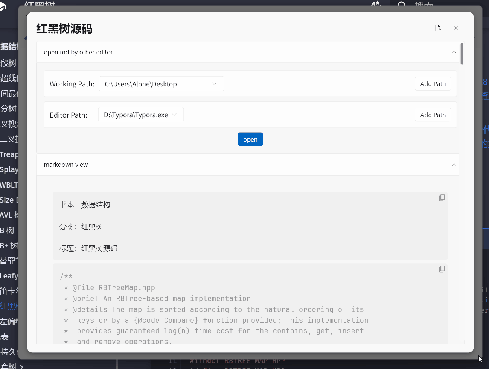

# NoteWithCards - 本地卡片式分类笔记软件
## 特性
* 👀随想随记,对每个想法以卡片的形式保存.
* 🤺不替代任何现有的markdown编辑器,目标是成为详细笔记的中间层.
* 💪对于任意的卡片内容支持导出成markdown或直接保存并自动使用其他markdown编辑器进行编辑.
* 📲所有数据基于本地数据库,支持一键导入或导出数据(产生一个文件).
* 📗提供绿色软件包(一个只有13mb的压缩包),且内存占用非常小(40mb左右).
* ✨重复打开不会开启多个进程,而是将之前的进程窗口立马显示到前台.
* 🔥跨全平台,由于使用flutter进行开发,客户端代码是跨全平台的(但是目前我本地环境只有windows,所以只编译了Windows).
> 随想随记的卡片式笔记分类,作为详细笔记记录的中间层,不替代任何现有的笔记软件.
## 如何使用
[视频教程]()
1. 请到[release](https://github.com/ACking-you/NoteWithCard/releases)页面下载对应的软件压缩包,然后解压到某个位置.(暂时只打包了Windows,如果有需求后续可以打包其他平台).
2. 解压后点开 `note_app.exe` 便可使用该软件.
3. 下面是在对应书本添加卡片笔记的使用示例:
    

更多完整的使用方式可以查看视频教程,也可以继续查看 [详细教程](https://github.com/ACking-you/NoteWithCard#%E8%AF%A6%E7%BB%86%E6%95%99%E7%A8%8B).
## 项目背景
为什么要写这样一个软件?
我想于我而言至少是要解决下面这几个痛点:
* 记录markdown笔记的时候,知识并没有得到很好的分类管理. 
* 在书本或者博客中获得了零碎的知识,但暂时并没有详细整理并记录的想法.
* 笔记内容过于零散,不好快速查找和翻看.
* 笔记内容不好集中管理导入导出(本地).
* 缺少一款轻量且使用简单的读书笔记分类软件.

## 详细教程
假设我们在网上看到了一篇博客,比如我们这里以 oi-wiki 上对红黑树的描述为例,假设需要记录里面完整的实现代码.具体的网址为:https://oi-wiki.org/ds/rbtree/.
### 增删改查
我们首先增加一个名为 `数据结构` 的书签,然后以这个书签为基础增加一个卡片记录,卡片标题为 `红黑树源码实现` ,分类为 `红黑树` ,并将该源码粘贴到详情记录中.具体操作如下:


从上述操作中,我们明白下列几点:
* 在经过需要操作的元素的时候,会出现增删改查的图标.
* 在卡片的添加页面中,分为必填和选填的内容,必填内容为1.卡片标题2.所属书签3.所属分类,而选填内容是更为详细的笔记描述,该描述支持markdown语法,且可以实时预览.

添加卡片后,我们如何查看卡片呢?
1. 你可以通过书签页面点击对应的书签可以跳转到该书签的所有卡片.
2. 你可以通过分类页面点击后跳转到该分类所有卡片,分类的右上角数字表示该分类的卡片有多少个.
3. 你还能通过搜索框以卡片的标题对具体的卡片进行查找.

如下图:


### 数据的导入与导出

#### 一键导出
在保存好卡片后,它存储在本地的数据库中,它同样也是支持一键导入或导出所有数据的.
只需要点击下面的 Import 或 Export 可实现导入和导出,导出的数据以一个文件的形式存在,便于保存和收发.

#### 单文件导出
除了上述一键导出的方式以外,你还可以把单个卡片导出为markdown文件.在查看卡片的内容时,可以点击下列图片中的图标实现.


### 工作目录与第三方编辑器
有些时候我们需要对卡片中内容进行详细的整理和编写,本软件支持将卡片内容以第三方编辑器打开编辑.
具体而言需要经过两个过程,保存卡片内容到 `工作目录` ,然后通过你指定的第三方编辑器打开这个文件.
第一次使用需要手动指定工作目录和需要打开的编辑器.
如图:


### 主题与布局
本软件也是支持调整主题和布局的,主题支持黑暗模式和明亮模式,布局支持如下:


## 技术栈
由于软件是完全的本地存储,所以并不存在严格意义上的前后端分离.

软件采用 [flutter](https://flutter.cn/) 框架进行跨端开发,而对于某些需要底层系统调用的部分则使用ffi调用[C++代码](https://github.com/ACking-you/windowsapp_singleton).

为了实现程序多次点开只复用并通知同一个进程打开展示的效果,我写了一个C++插件,然后通过ffi进行调用,对应的C++插件代码库:https://github.com/ACking-you/windowsapp_singleton

用到的flutter插件:
* 数据库:由 [isar](https://github.com/isar/isar) 提供高性能且高易用性的本地嵌入式 nosql 数据库.
* 状态管理:由 [go_router](https://pub.dev/packages/go_router) 提供路由跳转,由 [provider](https://github.com/rrousselGit/provider) 提供数据状态管理.
* 序列化支持:由 [crimson](https://github.com/simc/crimson) 提供json序列化支持,由 build_runner 提供自动化代码生成.
* UI组件:由 [fluent_ui](https://github.com/bdlukaa/fluent_ui) 提供整体界面开发的脚手架,由 [markdown_viewer](https://github.com/tagnote-app/markdown_viewer) 提供markdown预览支持.


## 编译运行

在编译前请确保对应的环境已经准备好,关于flutter开发所需要的基本环境这里不再赘述.

* 由于使用isar作为本地持久化,所以需要下载对应平台的动态库放入lib文件夹:https://github.com/isar/isar/releases. 
* 接下来需要下载对单个进程复用的动态库(目前只支持Windows),这个动态库需要放到编译生成的可执行文件目录中:https://github.com/ACking-you/windowsapp_singleton/releases.

最后只需要运行命令:(如果是macos,则将windows替换即可)
```shell
flutter build windows
```